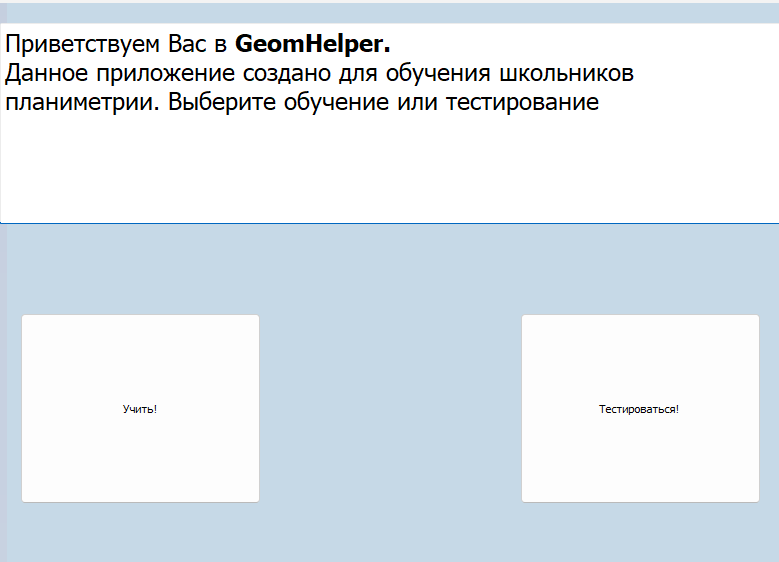
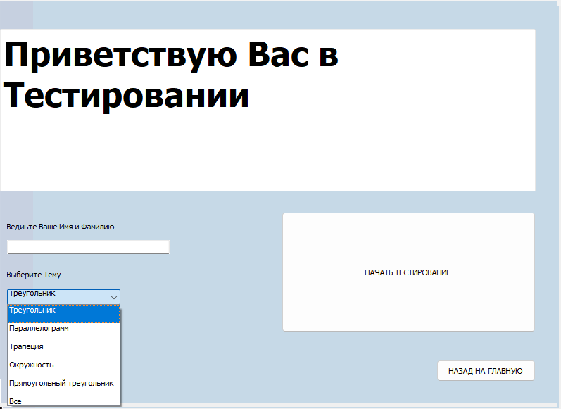
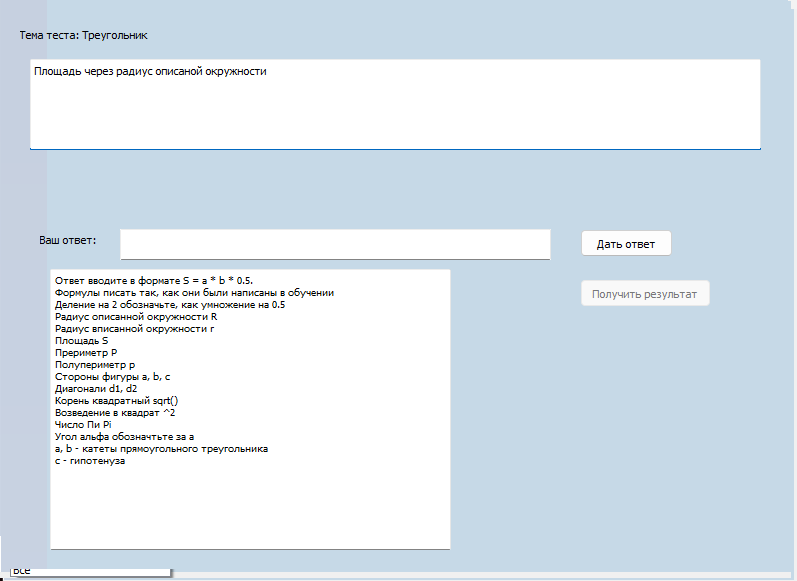
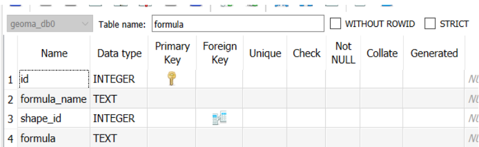

# Пояснительная записка

## Краткое описание

Приложение "GeomeHelper" создано для помощи ученикам школ в запоминании различных формул по планиметрии.
А так же проверки знаний формул в формате теста.

### Что вннутри?

**Приложение состоит из двух частей:**

* _Обучение_
* _Тестирование_

### Окно приветствия

Первое, что встречает пользователя при запуске приложения - окно приветствия, где пользователь может выбрать
себе занятие: либо обучение, либо тестирование. При нажатии на одну из кнопок пользователь перенаправится
в соответствующее окно

### Окно подготовки к обучению

Это второе окно в приложении. Здесь можно выбрать тему, которую желаете изучить.
Возможно выбрать одну из пяти тем:

* треугольник
* Параллелограмм
* Трапеция
* Окружность
* Прямоугольный треугольник

### Окно обучения

Третье окно в приложении предозначается непосредственно для обучения. Можно выбрать формулы, которые хочет
узнать пользователь. Они появятся в правой части окна по середине

### Окно подготовки к тестированию

В этом окне пользователю небходимо ввести свое имя и фамилию. Если же пользователь этого не сделает,
то выйдет диалоговое окно, которое все же вынудит его это сделать. Так же пользователю предстоит выбрать одну из
6 тем для тестирования, а именно:

* треугольник
* Параллелограмм
* Трапеция
* Окружность
* Прямоугольный треугольник
* Тест по всем темам

### Окно тестирования

В этом окне пользователю предстоит пройти тест из пяти вопросов по выбранной теме.
При прохождении всех вопросов становится доступна кнопка "Получить ответ", при нажатии на которую пользователь попадает
на последнее оккнко - окно результатов.

### Окно результатов

Последнее окно - окно результатов. В нем демонстрируются лучшие результаты пользователей по темам. В правом верхнем углу
видны ваши ошибки при прохождении теста, если они есть

## Итого

Данное приложение будет полезно как школьникам, которые только вливаются в геометрию, так и школьникам, у которых на
носу экзамены, чтобы освежить все в памяти.
Проект возможно развить дальше. Увеличить список изучаемых фигур, формул. Так же можно добавить отдельное приложение для
училя, чтобы была возможность легко добавлять вопросы, возможно даже не только по геометрии

## Установка

Чтобы запустить приложение необходимо установить папку dist на свой ПК и открыть приложение GeomeHelper.exe

## Используемые технологии

### _*main.py*_

В программе основной класс - MyGeomeHelper - окно, визуализирующее все пользвователю. Находится в main.py. Является
объектом класса QMainWindow. В нем расположен QStackedWidget, в котором расположены все окна. С его помощью реализовано
перемещение между окнами.

### _*testing.py*_

Создает и проверяет тест, так же заносит результаты в базу данных

### _*База данных*_

таблица shape

Id фигуры - первичный ключ
в таблице хранятся названия фигул и соответствующие им id

таблица formula

Id формулы - первичный ключ
Так же shape_id связывет таблицу formula с таблицей shape по id фигуры
В таблице хранятся формулы фигур

таблица result

В таблице представлены имена учеников, прошедших тест, тему, по которой проходили тест, и их результат
---
в папке load_files лежат файлы, необходимые для запуска программы.

